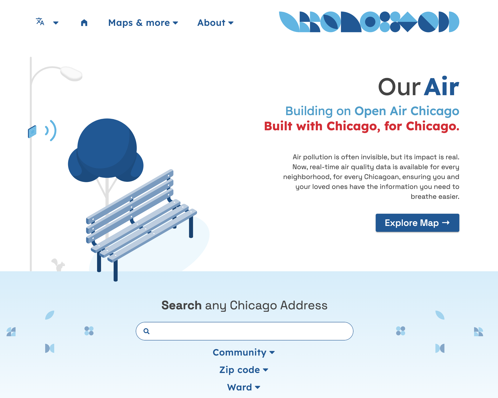

# Our Air: A Chicago Mapping Application
### Building on the Open Air Chicago Sensor Network

[Our Air](#) is a Chicago mapping application that serves as a vital bridge between air quality data, scientific exploration, community empowerment, and advocacy, making city-wide air quality metrics legible for all Chicago residents. 

We present and build on the largest [sensor-based air monitoring network](https://www.chicago.gov/city/en/depts/cdph/supp_info/Environment/open-air-chicago.html) in the U.S. (and the second largest in the world) with community and cross-sector collaborations to ensure the data is easily accessible, transparent, in context, and ready for action for policy-making and community empowerment, and advocacy. 

We will continue to refine and add to the dashboard with improvements and more resources over time. We welcome scientific, regulatory, and community input.

Read more about the projects and people involved at our [About](#) Page.

## Citation
Upon its first official release, the formal citation of the **Open Air** project will be managed by *Zenodo*. Check back for updates, with the final launch planned by the end of July 2026.

## Technical Development

**Open Air**  is an open source project, with its website development led by the [Healthy Regions & Policies Lab (HEROP)](https://healthyregions.org/) at the Department of Geography & GIScience at the University of Illinois at Urbana-Champaign.

Sara Lambert (UIUC, NCSA) was the lead software engineer in this development, with infrastructure development by Adam Cox (former UIUC) and support by multiple team members at HEROP, overseen by M. Kolak (UIUC). Design was led by Shubham Kumar (UIUC). We are grateful to  UIC and multiple community teams and residents who co-designed and co-developed at all stages of implementation, helping make this vision a reality. We are thankful to the Project PI, Prof Serap Erdal (UIC), for their constant support and integration of our team into the wider Chicago "sensing" space, as well as Drs Persky, Wang, and all the UIC team collaborators.

The Chi Air Application is a fork of [ChiVes](chichives.com), another open source project managed by the HEROP team. 

See the development [docs](./docs) for how to build and run this application locally.